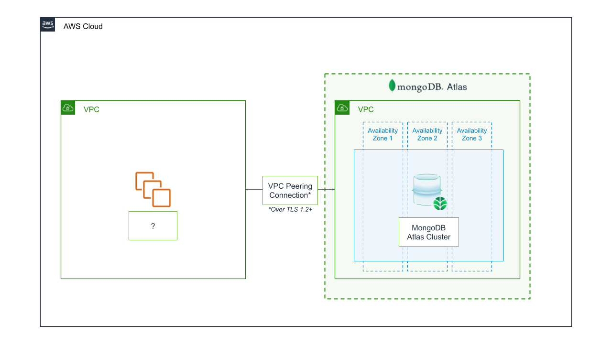

The Quick Start provides 3 deployment options: 

1. Atlas Deployment + peering with new AWS VPC
2. Atlas Deployment + peering with existing AWS VPC
3. Atlas Deployment - without peering

Deploying this Quick Start for an existing virtual private cloud (VPC) with
default parameters builds the following _{partner-product-short-name}_ environment in the
AWS Cloud. You application fills in the missing piece.

// Replace this example diagram with your own. Send us your source PowerPoint file. Be sure to follow our guidelines here : http://(we should include these points on our contributors giude)
[#architecture1]
.Quick Start architecture for _{partner-product-short-name}_
[link=images/simple-quickstart-arch.png]

As shown in Figure 1, the Quick Start sets up the following:

- A highly available architecture that spans at least three Availability Zones.
- MongoDB Atlas Project, Database User, Cluster, Project IP Access List
- An optional VPC Peering between your existing VPC and your new Atlas Deployment.

